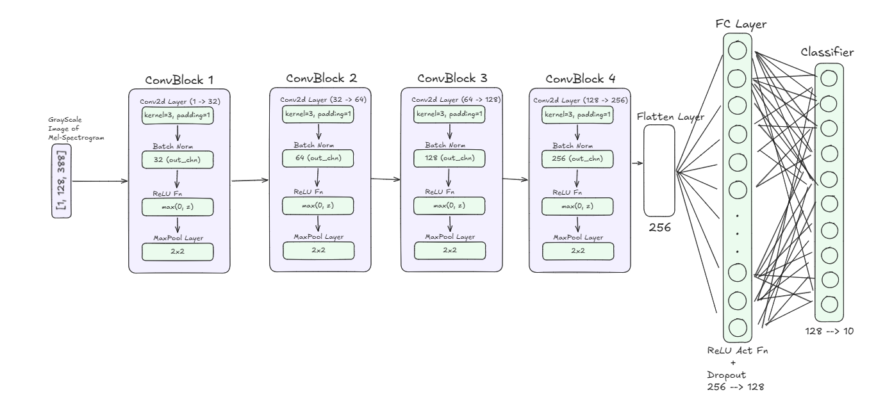
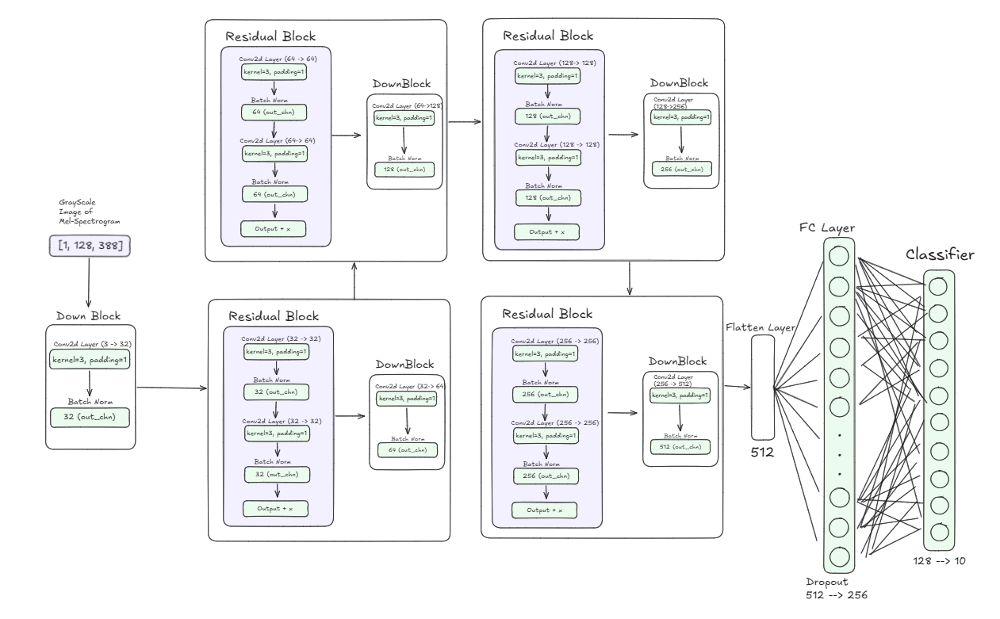
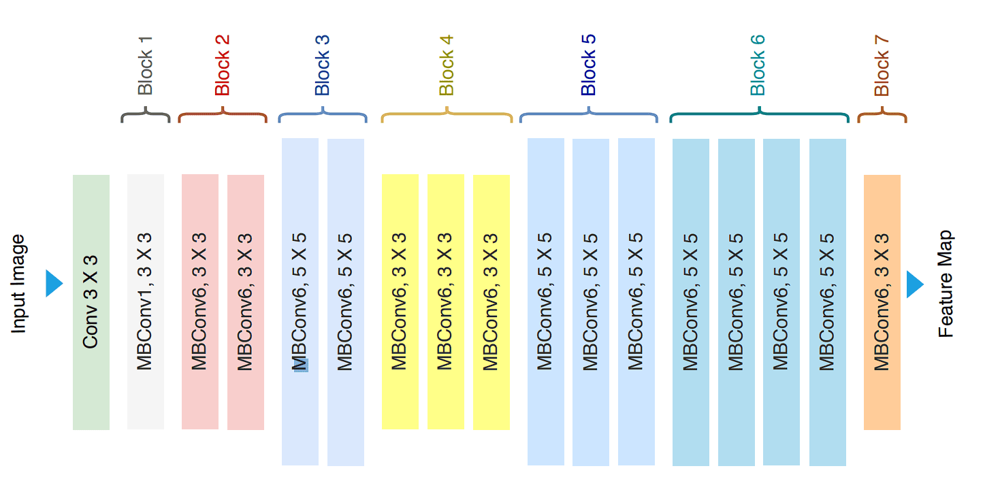
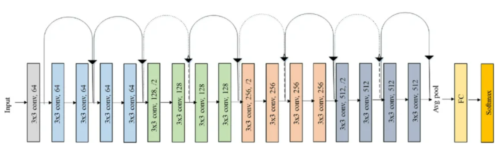
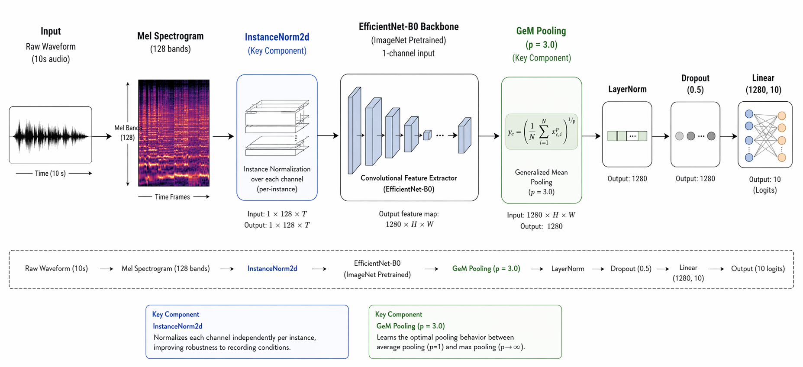

<h1 align="center"> Messy Audio Genre Classification </h1>

<p align="center"><i>Name: Kaushal Vaid </i> </p>

# Classification on Messy Mashups

> Robust music genre classification under heavily degraded, noisy, real-world mashup conditions.

---

## Deployment Link

https://kaushal00vaid-messy-music-genre-classifier.hf.space

---

## Problem Statement

Given multi-stem audio tracks (drums, vocals, bass, other) from 10 music genres, classify each track correctly, but the catch is the **test data is a chaotic mess**: stems are cross-mixed across genres, tempo-shifted, and layered with heavy environmental noise (sirens, dogs, babies crying, vacuums, etc. from the ESC-50 dataset).

The core challenge is bridging the **domain gap** between clean training data and brutally degraded test conditions.

**Evaluation Metric:** Macro F1-Score  
**Best Leaderboard Score:** `0.94793 F1 macro`

---

## Models Used
- Scratch CNN
- ResNet-18
- EfficientNet-B3
- EfficientNet-B0
- ResNet-50
- AST (Audio Spectrogram Transformer)

---

## Preprocessing Pipeline

**V1 (Failed):**

- Summed stems 50% of the time
- Single noise clip at high SNR (5–20 dB)
- 1-channel grayscale Mel-Spectrogram

#### **The Result (with V1)**
| Model               | Type                     | Score(Val F1 macro) |
| ------------------- | ------------------------ | ------------        |
| ScratchCNN (v1)     | 4-block custom CNN       | ~0.10               |

**V2 (Robust Pipeline):**

- 100% cross-stem mixing across genres
- Per-stem tempo augmentation (±10% time-stretch before mixing)
- Aggressive noise injection at SNR 0–15 dB (sometimes multiple clips layered)
- 3-channel dynamic feature extraction: Mel + delta + delta-delta
- MixUp augmentation on spectrograms and labels
- OneCycleLR scheduler with warmup
- 5-Crop Test-Time Augmentation (TTA) at inference

#### **The Result (with V2)**
| Model               | Type                     | Score(Val F1 macro) |
| ------------------- | ------------------------ | ------------        |
| CustomCNN (v2)      | Residual + Attention CNN | 0.70105             |
| ResNet50            | Pretrained baseline      | 0.49205             |
| ResNet18            | Fine-tuned               | 0.80869             |
| **EfficientNet-B3** | **Fine-tuned (best)**    | **0.80933**         |

**V3 (Generated More samples per epoch)**
- In this preprocessing pipeline, in the `Dataset` class in `__getitem__` it is generating new stem mixing everytime it is getting called.
- Therefore building 1000 **new** samples every epoch. Resulting in training on **30,000** samples rather than just 1000 samples in like in V2 pipeline.
- *Rest every preprocessing step same as V2*

#### The Result (with V3)
| Model               | Type                     | Score(Val F1 macro) |
| ------------------- | ------------------------ | ------------        |
| EfficientNet-B0     | Fine-Tuned               | 0.94520             |
| **ResNet-50**       | **Fine-tuned**           | **0.94793**         |
| AST                 | Fine-tuned               | 0.93261             |


---

## Final Approach

### Preprocessing
- Generating 1000 random stem mixings per epoch. 1000 * 30 epochs = 30,000 samples per model.
- Cross stem mixing - Building a song from stems of different songs of same genre. Drums of Song 1 + Bass of Song 2 + Vocals of Song 3 + Others of Song 4
- Environmental Noise Injection - 0 to 2 clips at SNR 5-25 dB
- Time stretching before mixing
- Mixup Augmentation - 2 freq masks + 2 time masks
- TTA - Test Time Augmentation

## Model Architectures

1. Scratch CNN (V1)

2. CustomCNN (V2)

3. EfficientNet-B3 (V2)

4. ResNet-18 (V2)

5. EfficientNet-B0 (V3)

6. ResNet-50 (V3)

7. AST - Audio Spectrogram Transformer (V3)


---

## Folder Structure

```
.
├── assets # having all training curves and confusion matrix and EDA images
│   ├── AST/
│   ├── EDA/
│   ├── EfficientNet-B0/
│   ├── ResNet-50/
│   ├── architectures/
│   ├── kaggle_submission_proof.png
│   └── song0001.wav
├── models/
│   ├── best_ast.pth # gitignored -- huge size
│   ├── best_efficientnet-b0.pth
│   ├── best_resnet-50.pth
│   └── model.ckpt
├── notebooks/
│   ├── EDA/
│   │   ├── EDA-V1.ipynb
│   │   └── EDA-V2.ipynb
│   ├── astaudio-spectrogram-transformer-ast.ipynb
│   ├── baselines/
│   │   ├── efficientnet_b3_baseline.ipynb
│   │   └── resnet50_baseline_0.49205.ipynb
│   ├── efficientnet-b0.ipynb
│   ├── milestone-deliverables/
│   └── resnet-50.ipynb
├── reports/
├── src
│   ├── outputs
│   │   ├── AST
│   │   │   ├── submission_ast.csv
│   │   │   └── test_probs_ast.npy
│   │   ├── EfficientNet-B0
│   │   │   ├── submission.csv
│   │   │   └── test_probs_efficientnet.npy
│   │   └── ResNet-50
│   │       ├── submission.csv
│   │       └── test_probs_resnet.npy
│   └── scripts
│       ├── ast.py
│       ├── caching.py
│       ├── dataset.py
│       ├── efficientnet.py
│       ├── helper.py
│       └── resnet.py
├── README.md
├── app.py
├── inference.py
├── requirements.txt
```

---

## References

- _DL for Audio Classification_ — Seth Adams
- _Audio Signal Processing_ — Valerio Velardo
- EfficientNet Architecture — GeeksForGeeks
- DLGenAI Course Lectures, CampusX (100 Days of DL)
